# Want to see how easy to deploy a containerized app in Elastic Container Service using Fargate?

## Project: 
- Simple web app deployment on ECS

## Installaion:
1.	Docker: Used to build and manage container images
2.	Terraform: Infrastructure as Code (IaC) tool to automate AWS resource creation
3.	Visual Studio Code
4.  AWS CLI

## Pre-requisites:
1.	Build an docker image using given docker file.
```bash
    - docker build -t hello-world . 
    - docker tag hello-world <aws_account_id>.dkr.ecr.region.amazonaws.com/hello-repository
```
2.	Tag the image for AWS ECR.
```bash
    - docker tag hello-world <aws_account_id>.dkr.ecr.region.amazonaws.com/hello-repository
```

3.	Create the repo in ECR using AWS CLI.
```bash
    - aws ecr create-repository --repository-name hello-repository --region region
```

4.	Push the docker image in ECR by authenicating with ECR
```bash
    - aws ecr get-login-password --region region | docker login --username AWS --password-stdin aws_account_id.dkr.ecr.region.amazonaws.com
```
```bash
	- docker push aws_account_id.dkr.ecr.region.amazonaws.com/hello-repository
```

5.	Create a terraform IAM user with programmtic access in your AWS account and extract the access & secret key & update the key in .aws file in local.

## Clone my GitHub repo for complete terraform code and perform below steps
1.	Clone my repo.
```bash
    git clone <your-github-repo-url>
```
2.	Update input.tfvars with your AWS account details:
    -   Replace aws_account_num with your AWS account number.
    -   Update the Docker image name and version.

3.	Open the terminal and use terraform commands to deplot:
    - Plan: You’ll see 35 AWS components will be created which is needed in this deployment.
```bash
        run terraform plan -var-file input.tfvars
```
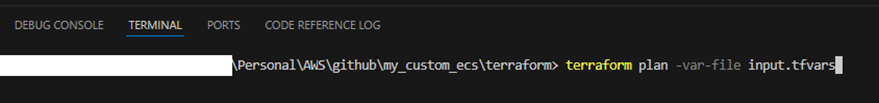
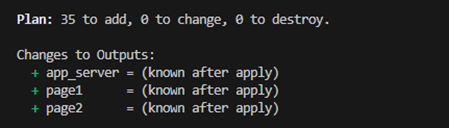

    - Apply: 
```bash
    run terraform apply -var-file input.tfvars -auto-approve
```
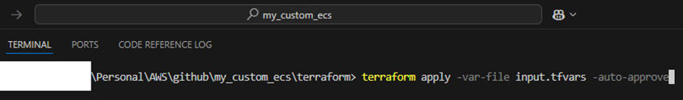

    -   It will take 4-5 mins to complete and then you’ll see below output.
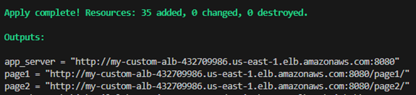

## Output:
1. Network Infrastructure:

   -    Custom VPC with:
        -   Public and private subnets.
        -   Internet Gateway and Route Tables.
        -   NAT Gateway and Elastic IP for private subnets.
        -   Security groups with appropriate ingress/egress rules.
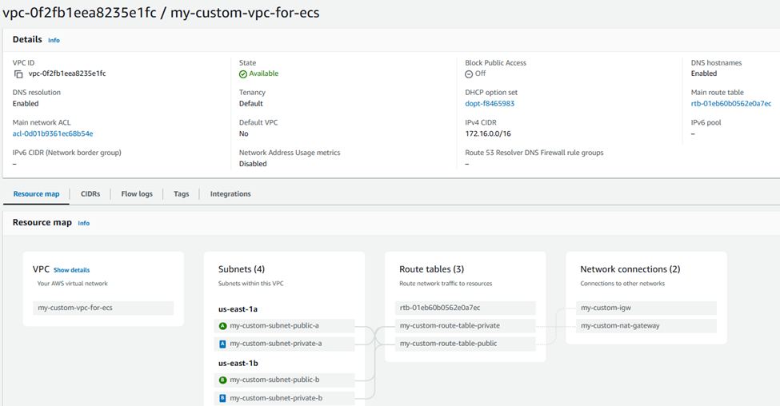

2. ECS Setup:

   -    ECS Cluster, Service, Task Definition.
   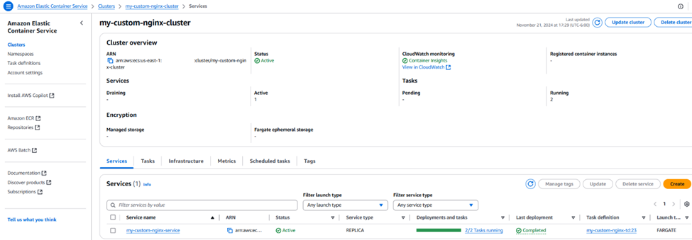

   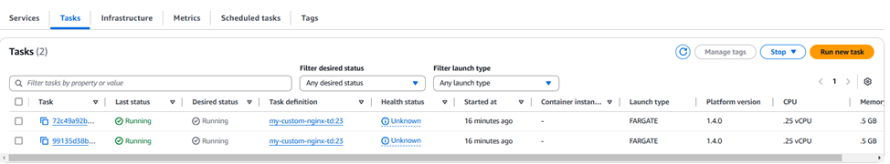

   -    ECS Auto-Scaling Role & Policy.
   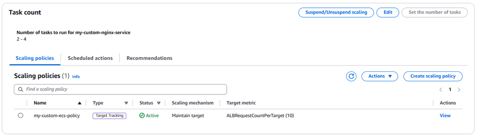

   -    ECS Task definition,Execution Role & Policy.
   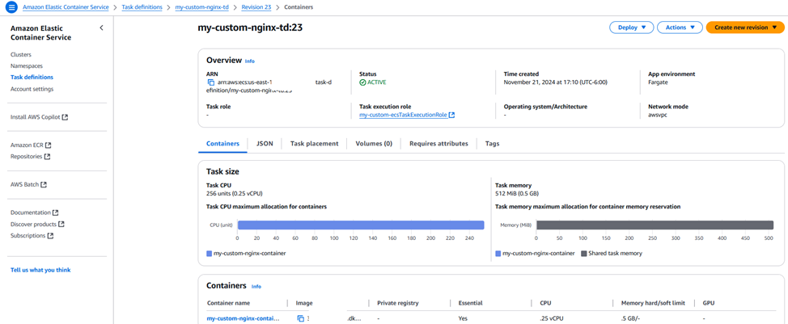

   -    Security Group.

3. Load Balancing:

   -   Application Load Balancer (ALB) with:
   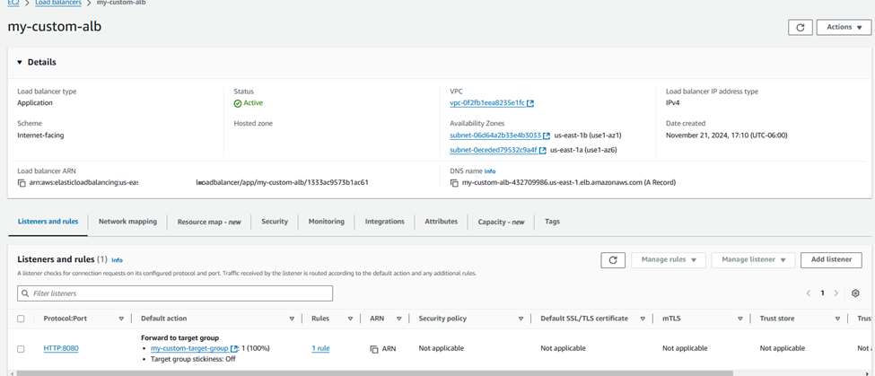

       -   Listeners and Target Groups.
    

    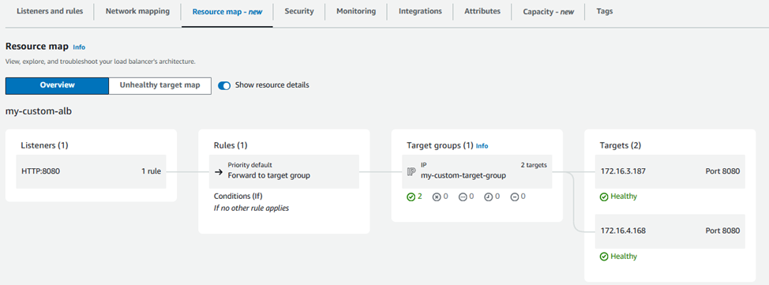
       -   Security Group.


4. Links:
-   Nginx web server:
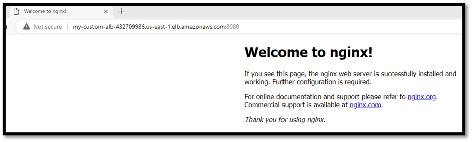

- App Page1
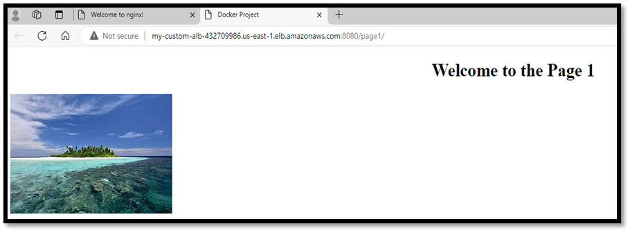

- App Page2
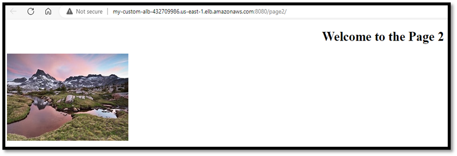


# Clean Up:
- Don't forget to destroy all the components
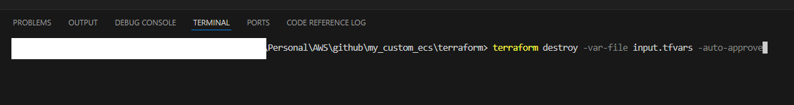
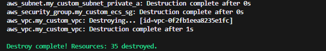